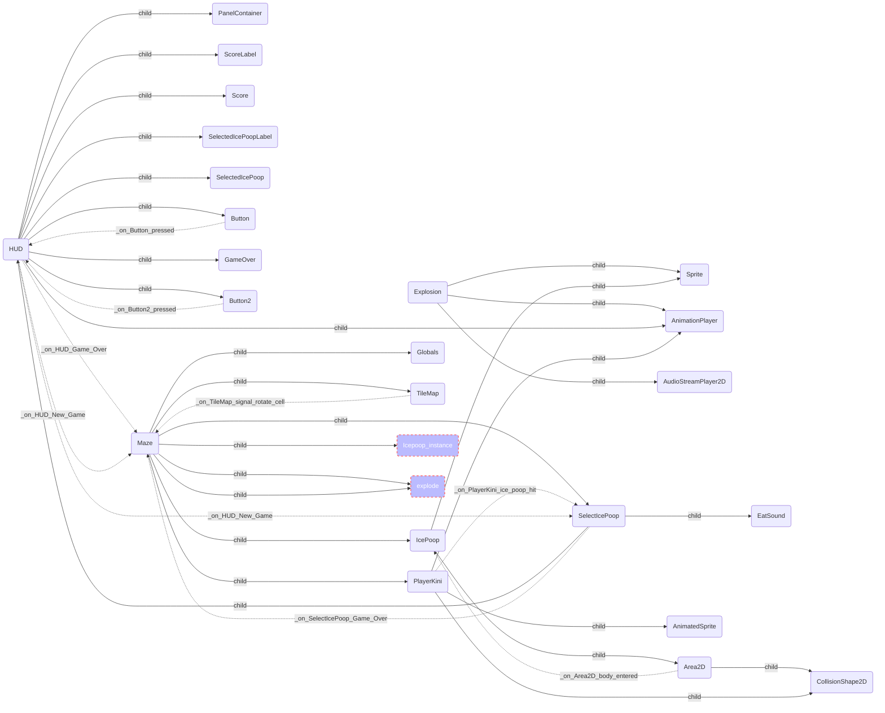

Limitation: 
Nodes have to have unique names 

```mermaid 
 flowchart LR 
 
Explosion(Explosion)---> |child| Sprite(Sprite)

Explosion(Explosion)---> |child| AnimationPlayer(AnimationPlayer)

Explosion(Explosion)---> |child| AudioStreamPlayer2D(AudioStreamPlayer2D)

HUD(HUD)---> |child| PanelContainer(PanelContainer)

HUD(HUD)---> |child| ScoreLabel(ScoreLabel)

HUD(HUD)---> |child| Score(Score)

HUD(HUD)---> |child| SelectedIcePoopLabel(SelectedIcePoopLabel)

HUD(HUD)---> |child| SelectedIcePoop(SelectedIcePoop)

HUD(HUD)---> |child| Button(Button)

HUD(HUD)---> |child| GameOver(GameOver)

HUD(HUD)---> |child| AnimationPlayer(AnimationPlayer)

HUD(HUD)---> |child| Button2(Button2)

IcePoop(IcePoop)---> |child| Sprite(Sprite)

IcePoop(IcePoop)---> |child| Area2D(Area2D)

Area2D(Area2D)---> |child| CollisionShape2D(CollisionShape2D)

Maze(Maze)---> |child| Globals(Globals)

Maze(Maze)---> |child| TileMap(TileMap)

Maze(Maze)---> |child| PlayerKini(PlayerKini)

Maze(Maze)---> |child| IcePoop(IcePoop)

Maze(Maze)---> |child| SelectIcePoop(SelectIcePoop)

SelectIcePoop(SelectIcePoop)---> |child| HUD(HUD)

SelectIcePoop(SelectIcePoop)---> |child| EatSound(EatSound)

PlayerKini(PlayerKini)---> |child| AnimatedSprite(AnimatedSprite)

PlayerKini(PlayerKini)---> |child| CollisionShape2D(CollisionShape2D)

PlayerKini(PlayerKini)---> |child| AnimationPlayer(AnimationPlayer)

Maze(Maze)---> |child| Icepoop_instance(Icepoop_instance)
style Icepoop_instance fill:#bbf,stroke:#f66,stroke-width:2px,color:#fff,stroke-dasharray: 5 5
Maze(Maze)---> |child| explode(explode)
style explode fill:#bbf,stroke:#f66,stroke-width:2px,color:#fff,stroke-dasharray: 5 5
Maze(Maze)---> |child| explode(explode)
style explode fill:#bbf,stroke:#f66,stroke-width:2px,color:#fff,stroke-dasharray: 5 5
Button(Button)-.-> |_on_Button_pressed| HUD(HUD)

Button2(Button2)-.-> |_on_Button2_pressed| HUD(HUD)

Area2D(Area2D)-.-> |_on_Area2D_body_entered| IcePoop(IcePoop)

TileMap(TileMap)-.-> |_on_TileMap_signal_rotate_cell| Maze(Maze)

PlayerKini(PlayerKini)-.-> |_on_PlayerKini_ice_poop_hit| SelectIcePoop(SelectIcePoop)

SelectIcePoop(SelectIcePoop)-.-> |_on_SelectIcePoop_Game_Over| Maze(Maze)

HUD(HUD)-.-> |_on_HUD_Game_Over| Maze(Maze)

HUD(HUD)-.-> |_on_HUD_New_Game| Maze(Maze)

HUD(HUD)-.-> |_on_HUD_New_Game| SelectIcePoop(SelectIcePoop)

```