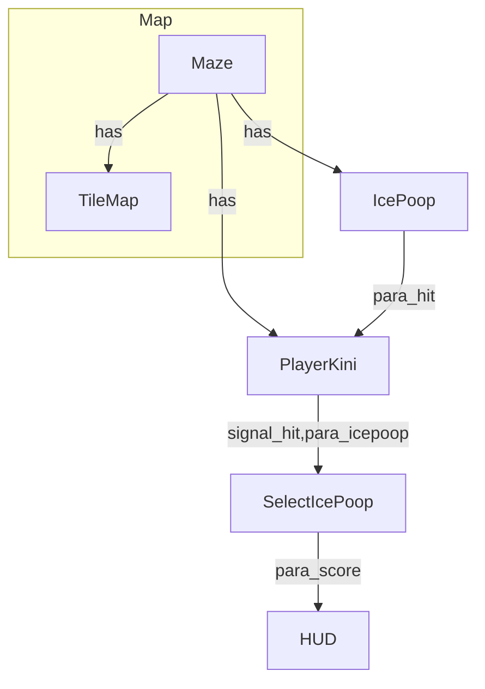

# BollyTheMalt

## **Drawing the map:**

Tileset value explaination:

->Road open end = 0  
->Road close end = 1  

Read the bits Anti clockwise starting from the left

Example: 
The Value for the following TileSet = 1011 = "11.png"  

---

### Features TODO
- [ ] Consider Nodes created in script 
	- [x] Parse (add_child --> .tscn)
	- [ ] Link add_child node to its .tscn
	- [ ] Consider instance creation within loops (For,while..)
	- [ ] Consider conditional instance creation (if,..)
		
- [ ] Support .cfg file for configuring the plugin
	- [ ] Path of the model to be generated
	- [ ] Path and Name of the generated file
	- [ ] Notify before over-write the generated file (ON/OFF)
	- [ ] Diagram direction (TD , LR)
		
- [ ] Enhance generated .md file (customization)
	- [x] Adding Heading - with Some Model Information (Basic)
	- [ ] Think of re-arrange the diagram to Sub-diagrams?
	- [ ] Parse Comments??
	- [ ] Scan scripts for functions? + add them related to the Node?
		
- [ ] Publish Plugin (ex https://github.com/ClarkThyLord/Voxel-Core)
	- [ ] Standalone Git repo
	- [ ] Rename Plugin to Model_DiagramGen
	- [ ] versioning
	- [ ] ReadMe ( plugin description, limitation, example, usage..)
	- [ ] License File
	- [ ] Upload to asset_liberary (https://godotengine.org/asset-library/asset)
		
- [x] Change plugin Interface ( Button --> Shortcut key)

- [x] Test Env and Testing

	

### Known Bugs
  1. [x] Notification before overwriting the Generated file.
  2. [x] Highlight Main node (Start Point) in diagram
  3. [x] Change is_key_pressed
  4. [ ] Clean duplicate lines in .md

