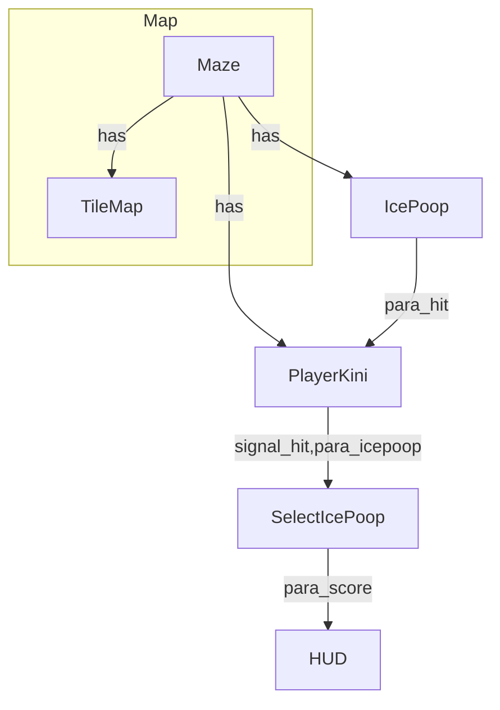

# BollyTheMalt

## **Drawing the map:**

Tileset value explaination:

->Road open end = 0  
->Road close end = 1  

Read the bits Anti clockwise starting from the left

Example: 
The Value for the following TileSet = 1011 = "11.png"  

---

### Features TODO
	1. Consider Nodes created in script 
		a. Parse (add_child --> .tscn)
		b. Link add_child node to its .tscn
		c. Consider instance creation within loops (For,while..)
		d. Consider conditional instance creation (if,..)
		
	2. Support .cfg file for configuring the plugin
		a. Path of the model to be generated
		b. Path and Name of the generated file
		c. Notify before over-write the generated file (ON/OFF)
		d. Diagram direction (TD , LR)
		
	3.  Enhance generated .md file (customization)
		a.  Adding Heading - with Some Model Information (Basic)
		b. Think of re-arrange the diagram to Sub-diagrams?
		c. Parse Comments??
		d. Scan scripts for functions? + add them related to the Node?
		
	4. Publish Plugin (ex https://github.com/ClarkThyLord/Voxel-Core)
		a. Standalone Git repo
		b. Rename Plugin to Model_DiagramGen
		c. versioning
		d. ReadMe ( plugin description, limitation, example, usage..)
		e. License File
		f. Upload to asset_liberary (https://godotengine.org/asset-library/asset)
		
	5. Change plugin Interface ( Button --> Shortcut key)

	6. Test Env and Testing

	

### Known Bugs
	1. Notification before overwriting the Generated file.
	2. Highlight Main node (Start Point) in diagram
	3. Change is_key_pressed
	4. Clean duplicate lines in .md

