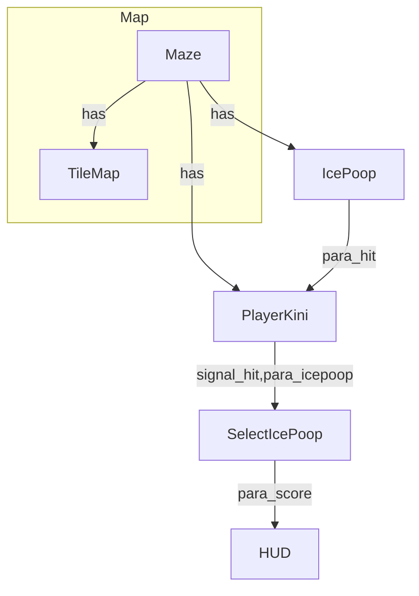

# BollyTheMalt

Drawing the map:

Tileset value explaination:

->Road open end = 0  
->Road close end = 1  

Read the bits Anti clockwise starting from the left

---

```mermaid
flowchart TD

M[Maze] -->|has| P[PlayerKini]
M[Maze] -->|has| I[IcePoop]

subgraph Map
    direction LR
    M[Maze] -->|has| TM[TileMap]
end

I -->|para_hit| P
P -->|signal_hit,para_icepoop| S[SelectIcePoop]

S -->|para_score| H[HUD]

```