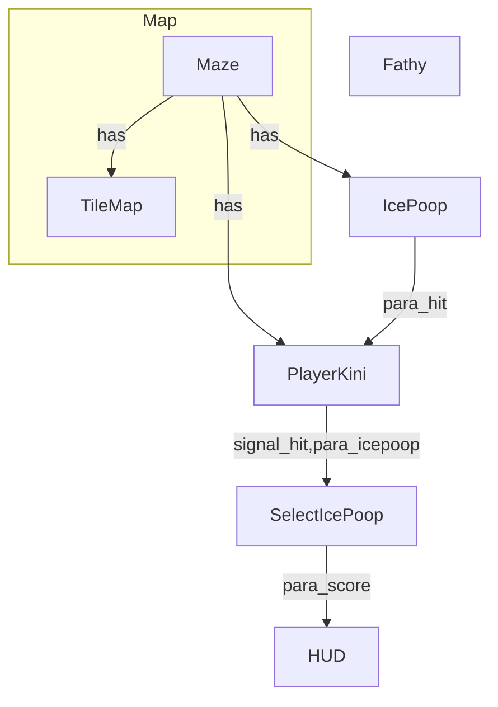

# BollyTheMalt

## **Drawing the map:**

Tileset value explaination:

->Road open end = 0  
->Road close end = 1  

Read the bits Anti clockwise starting from the left

Example: 
The Value for the following TileSet = 1011 = "11.png"  

---

